<!-- BANNER: retrato de puntos que se transforma en logos -->
<a href="https://github.com/SamuelCletoMalle">
  <picture>
    <source media="(prefers-color-scheme: dark)" srcset="assets/banner-dark.svg">
    <source media="(prefers-color-scheme: light)" srcset="assets/banner-light.svg">
    
  </picture>
</a>

 

---

## `$ whoami`

  

 

## `$ cat tech-stack.yaml`

<table border="1" cellpadding="14">
  <thead>
    <tr>
      <th colspan="2" align="left"><code>samu:~$ cat tech-stack.yaml</code></th>
    </tr>
  </thead>
  <tbody>
    <tr>
      <td width="50%" valign="top"><code>├─ ✦ lenguajes:</code>  
        
        
        
        
      </td>
      <td width="50%" valign="top"><code>├─ ▣ bases_de_datos:</code>  
        
        
        
        
        
      </td>
    </tr>
    <tr>
      <td valign="top"><code>├─ ◈ web_y_mobile:</code>  
        
        
        
        
        
        
      </td>
      <td valign="top"><code>├─ ⚙ cloud_y_versiones:</code>  
        
        
        
        
      </td>
    </tr>
    <tr>
      <td valign="top"><code>├─ ▤ sistemas:</code>  
        
        
         <code>hardware</code> <code>redes</code> <code>soporte</code>
      </td>
      <td valign="top"><code>╰─ ⌁ explorando:</code>  
        <code>IA aplicada</code> <code>Gemini API</code> <code>ciberseguridad</code>
      </td>
    </tr>
  </tbody>
  <tfoot>
    <tr>
      <td colspan="2"><code>status: estudiando_2º_DAM&nbsp;&nbsp;·&nbsp;&nbsp;disponible: prácticas</code></td>
    </tr>
  </tfoot>
</table>

---

## `$ cat skills-radar.log`

  <picture>
    <source media="(prefers-color-scheme: dark)" srcset="assets/radar-dark.svg">
    <source media="(prefers-color-scheme: light)" srcset="assets/radar-light.svg">
    
  </picture>

<code>signals: radar_de_habilidades · autoevaluado · status: en_crecimiento</code>

---

## `$ ls proyectos/ --destacados`

**💰 Balanz — app de finanzas personales**
> App móvil para controlar gastos: categorías, presupuesto, importación y exportación a Excel con detección de duplicados, base de datos local y sincronización en la nube con login. Empezó como prototipo web y ahora es una app Android. Proyecto de aprendizaje, todavía en desarrollo.

`React Native` `Expo` `TypeScript` `SQLite` `Supabase`

 

**🏋️ Zenith AI — app de fitness**
> App de entrenamiento para uso personal: rutinas, comidas, estadísticas, seguimiento corporal e hidratación, con asistente de IA. Web empaquetada para Android con Capacitor.

`React` `Vite` `TypeScript` `Firebase` `Gemini API` `Capacitor`

---

## `$ git log --stats`

---

<!-- REDES -->
## `$ connect --contacto`

&nbsp;&nbsp;

 
 

Hecho con 🧡 · @SamuelCletoMalle

