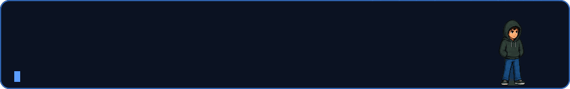

<!-- ESCENA: mini Samuel en pixel art -->

 

 

## `$ whoami`

  

## `$ ls proyectos/ --destacados`

  

  
  

## `$ cat tech-stack.yaml`

<table border="1" cellpadding="14">
  <thead>
    <tr>
      <th colspan="2" align="left"><code>samuel:~$ cat tech-stack.yaml</code></th>
    </tr>
  </thead>
  <tbody>
    <tr>
      <td width="50%" valign="top"><code>├─ ✦ lenguajes:</code>  
        
        
        
        
      </td>
      <td width="50%" valign="top"><code>├─ ▣ bases_de_datos:</code>  
        
        
        
        
        
      </td>
    </tr>
    <tr>
      <td valign="top"><code>├─ ◈ web_apps_y_juegos:</code>  
        
        
        
        
        
        
      </td>
      <td valign="top"><code>├─ ⚙ backend_y_cloud:</code>  
        
        
        
        
        
        
      </td>
    </tr>
    <tr>
      <td valign="top"><code>├─ ▤ sistemas:</code>  
        
        
         <code>hardware</code> <code>redes</code> <code>soporte</code>
      </td>
      <td valign="top"><code>╰─ ⌁ explorando:</code>  
        <code>agentes de IA</code> <code>Gemini API</code> <code>videojuegos 3D</code> <code>ciberseguridad</code>
      </td>
    </tr>
  </tbody>
  <tfoot>
    <tr>
      <td colspan="2"><code>status: estudiando_2º_DAM&nbsp;&nbsp;·&nbsp;&nbsp;disponible: prácticas&nbsp;&nbsp;·&nbsp;&nbsp;4h/día → jornada completa desde marzo</code></td>
    </tr>
  </tfoot>
</table>

## `$ cat certificados.log`

  

## `$ git log --stats`

<picture>
  <source media="(prefers-color-scheme: dark)" srcset="https://raw.githubusercontent.com/SamuelCletoMalle/SamuelCletoMalle/output/snake-dark.svg">
  
</picture>

## `$ connect --contacto`

  

